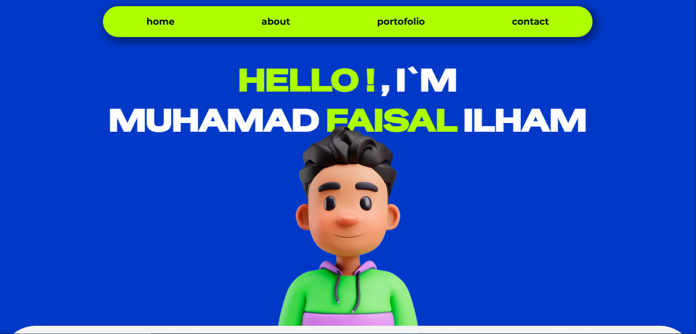
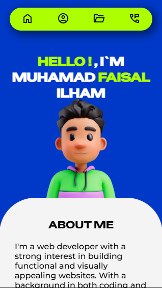

# Personal Landing Page

## Project Description

In this project, I created my personal landing page using HTML and CSS. I implemented various CSS techniques such as animations, Grid, Flexbox, overflow handling, and more.

## Preview

#### Dekstop


#### Mobile



url: ```https://vsalcode.github.io/```

## How To Run This Project

Clone this project url :

``` https://github.com/VsalCode/faisal.github.io.git ```

after entering the folder, install the dependencies:

```npm install```

To run the web you can use the command :

```npm run dev```

##  dependencies used
- Live Server


## How To Contribute

Pull requests are welcome. For major changes, please open an issue first
to discuss what you would like to change.

Please make sure to update tests as appropriate.

## License

[ISC](https://opensource.org/license/isc-license-txt)

## Credit 

Thank You for inspiration Web Design from :

1. [url pinterest](https://id.pinterest.com/pin/889742470193011943/)

2. [url pinterest](https://id.pinterest.com/pin/889742470192984429/)

3. [url pinterest](https://id.pinterest.com/pin/161918549097694199/)
